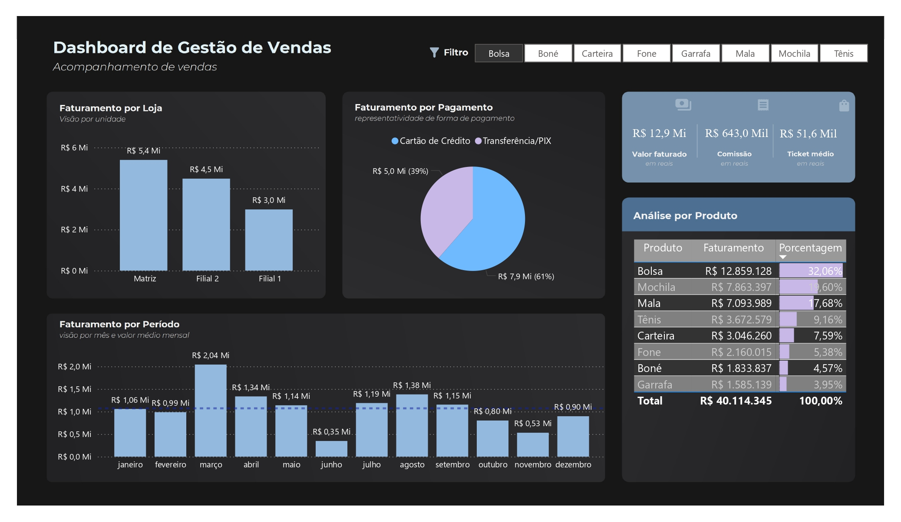

# Dashboard de Gestão de Vendas

Este projeto consiste na criação de um dashboard interativo para a gestão de vendas, desenvolvido utilizando Power BI. O objetivo principal é fornecer uma visão clara e detalhada das operações de vendas, permitindo uma análise eficaz dos dados para tomada de decisões.

## Descrição do Projeto

O dashboard, contido no arquivo `Dashboard de Gestão de Vendas.pbit`, oferece uma interface amigável para monitorar e analisar o desempenho de vendas. Com ele, é possível identificar tendências, acompanhar o cumprimento de metas e descobrir oportunidades de melhoria.

## Funcionalidades

- **Visão Geral das Vendas**: Acompanhe o total de vendas, receitas geradas e tendências ao longo do tempo.
- **Análise de Desempenho por Produto**: Visualize o desempenho individual de cada produto em termos de vendas.
- **Análise Regional**: Compare as vendas em diferentes regiões ou áreas geográficas.
- **Metas e KPIs**: Monitore o progresso em relação às metas estabelecidas, utilizando indicadores-chave de desempenho (KPIs).
- **Filtros Interativos**: Use filtros para visualizar dados específicos por período, produto, região, entre outros critérios.

## Requisitos

- **Power BI Desktop**: Para abrir e interagir com o dashboard, você precisará ter o Power BI Desktop instalado em seu computador.

## Como Usar

1. Clone o repositório para o seu ambiente local.
   ```bash
   https://github.com/Malu-luisa/Dashboard-Gest-o-De-Vendas.git

 
